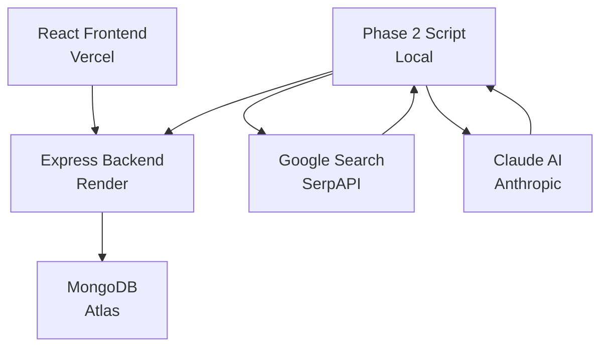

# BeyondChats Assignment - Complete Execution Plan

> **Execution Guide for GitHub Copilot & Development**  
> This document provides phase-by-phase prompts and checklists to build the entire project from scratch to submission.

---

## 📋 Pre-Development Checklist

### Repository Protection Setup (COMPLETED ✅)
- [x] GitHub repository created with custom MIT License
- [x] NOTICE file with IP protection
- [x] README.md with project overview
- [x] docs/EVIDENCE.md created
- [x] legal/DMCA-TEMPLATE.md prepared
- [x] .code-template.js created
- [x] monitor-usage.sh script ready
- [x] Directory structure: `backend/`, `frontend/`, `phase2/`, `docs/`, `tests/`, `legal/`, `monitoring-logs/`
- [x] Initial commit pushed to GitHub
- [x] WakaTime VS Code extension installed and tracking

### Pre-Development Actions Required NOW
- [ ] Archive BeyondChats website screenshots: `evidence/beyondchats-before-submission/`
- [ ] Archive repository on Internet Archive: https://web.archive.org/save/[your-repo-url]
- [ ] Set up GitLab mirror (optional)
- [ ] Take screenshot of job posting from Internshala
- [ ] Download assignment PDF for records

---

## 🎯 PHASE 1: Web Scraping & CRUD APIs (Days 1-3)

### **Day 1: Backend Setup & Web Scraper**

#### Morning Session (4 hours): Project Initialization

**Prompt for GitHub Copilot:**
```
Create a Node.js + Express backend with the following structure:

Project: BeyondChats Assignment - Article Scraper & API
Tech Stack: Node.js, Express, MongoDB, Puppeteer, Cheerio

Directory Structure:
backend/
├── src/
│   ├── scrapers/
│   │   └── blogScraper.js      # Scrapes BeyondChats blog
│   ├── models/
│   │   └── Article.js          # Mongoose schema
│   ├── routes/
│   │   └── articles.js         # CRUD routes
│   ├── controllers/
│   │   └── articleController.js # Business logic
│   ├── config/
│   │   ├── database.js         # MongoDB connection
│   │   └── constants.js        # App constants
│   ├── middleware/
│   │   ├── errorHandler.js     # Global error handler
│   │   └── validateRequest.js   # Input validation
│   └── utils/
│       └── logger.js           # Winston logger
├── tests/
│   └── scraper.test.js
├── .env.example
├── .gitignore
├── package.json
└── server.js

Requirements:
1. Use ES6 modules (type: "module" in package.json)
2. Add file header with copyright notice:
   /**
    * BeyondChats Assignment Project
    * Author: [Your Name]
    * Created: [Date]
    * Repository: github.com/[username]/beyondchats-assignment-2024
    * License: MIT with Attribution (see LICENSE)
    */
3. Environment variables: PORT, MONGODB_URI, NODE_ENV
4. Error handling with try-catch blocks
5. Logging with Winston
6. CORS enabled for frontend
7. Input validation middleware
```

**package.json dependencies:**
```json
{
  "name": "beyondchats-backend",
  "version": "1.0.0",
  "type": "module",
  "dependencies": {
    "express": "^4.18.2",
    "mongoose": "^8.0.3",
    "puppeteer": "^21.7.0",
    "cheerio": "^1.0.0-rc.12",
    "dotenv": "^16.3.1",
    "cors": "^2.8.5",
    "helmet": "^7.1.0",
    "express-rate-limit": "^7.1.5",
    "express-validator": "^7.0.1",
    "winston": "^3.11.0"
  },
  "devDependencies": {
    "jest": "^29.7.0",
    "supertest": "^6.3.3",
    "nodemon": "^3.0.2",
    "eslint": "^8.56.0"
  }
}
```

**Commit checkpoint:**
```bash
git add backend/
git commit -m "feat(backend): initialize Express server with project structure"
git push origin main
```

---

#### Afternoon Session (4 hours): Web Scraper Implementation

**Prompt for GitHub Copilot:**
```
Implement a robust web scraper for BeyondChats blog:

File: backend/src/scrapers/blogScraper.js

Requirements:
1. Target URL: https://beyondchats.com/blogs/
2. Navigate to LAST page of pagination
3. Scrape 5 OLDEST articles with fields:
   - title (required)
   - url (required, unique)
   - excerpt
   - author
   - publishedDate
   - thumbnail (if available)
   - tags/categories
   - scrapedAt (timestamp)

Implementation Details:
- Use Puppeteer for dynamic content handling
- Add retry logic (3 attempts with exponential backoff)
- Handle pagination detection automatically
- Scrape article preview/excerpt from listing page
- Implement rate limiting (2 second delay between requests)
- Add user-agent rotation
- Comprehensive error handling
- Return structured data array

Selectors to try (BeyondChats may use any):
- Articles: '.blog-card', '.article-item', 'article', '[data-article]'
- Title: 'h2', 'h3', '.title', '.article-title'
- URL: 'a[href]', '.read-more', '.article-link'
- Date: 'time', '.date', '.publish-date'
- Pagination: '.pagination', 'nav[role="navigation"]', '[aria-label*="pagination"]'

Add demo/watermark mode:
- If env var DEMO_MODE=true, add "// DEMO VERSION - Not for production use" in comments
- Implement request throttling to prevent production-level scraping
```

**Testing prompt:**
```
Create comprehensive tests:

File: backend/tests/scraper.test.js

Test cases:
1. Successfully scrapes exactly 5 articles
2. Handles network errors gracefully
3. Validates required fields (title, url)
4. Detects last page correctly
5. Respects rate limiting
6. Handles missing elements
7. Returns empty array if blog not found

Use Jest + mock Puppeteer responses
```

**Commit checkpoint:**
```bash
git add backend/src/scrapers/ backend/tests/
git commit -m "feat(scraper): implement BeyondChats blog scraper with pagination"
git push origin main
```

---

### **Day 2: Database & CRUD APIs**

#### Morning Session (4 hours): MongoDB Schema & Models

**Prompt for GitHub Copilot:**
```
Create Mongoose models and database configuration:

File: backend/src/models/Article.js

Schema:
- title: String, required, indexed for search
- url: String, required, unique, indexed
- excerpt: String, maxlength 500
- content: String (full article content, added in Phase 2)
- author: String
- publishedDate: Date, indexed
- thumbnail: String (URL)
- tags: [String]
- scrapedAt: Date, default: now
- metadata: {
    wordCount: Number,
    readingTime: Number,
    lastAnalyzed: Date,
    similarityScore: Number,
    rankingFactors: [String],
    isAIGenerated: Boolean,
    sourceType: String (enum: 'original', 'competitive-analysis', 'enhanced'),
    keywords: [String],
    references: [{
      title: String,
      url: String,
      scrapedAt: Date
    }]
  }
- timestamps: true (createdAt, updatedAt)

Indexes:
- Compound text index on title and content for full-text search
- Index on publishedDate (descending)
- Index on url (unique)

Virtual properties:
- formattedDate (returns human-readable date)
- shortExcerpt (returns first 100 chars)

Methods:
- calculateReadingTime() - estimates reading time
- addReference(title, url) - adds citation
```

**File: backend/src/config/database.js**
```
Create MongoDB connection with:
- Connection pooling (maxPoolSize: 10)
- Automatic reconnection
- Connection event logging
- Error handling
- Graceful shutdown on process termination
```

**Commit checkpoint:**
```bash
git add backend/src/models/ backend/src/config/
git commit -m "feat(database): add Article schema and MongoDB configuration"
git push origin main
```

---

#### Afternoon Session (4 hours): CRUD API Implementation

**Prompt for GitHub Copilot:**
```
Implement complete CRUD APIs:

File: backend/src/controllers/articleController.js

Endpoints with business logic:

1. CREATE Article
   POST /api/articles
   - Validate required fields
   - Check for duplicate URL
   - Calculate word count and reading time
   - Return 201 with created article

2. READ All Articles (with pagination & search)
   GET /api/articles?page=1&limit=10&search=keyword&sort=-publishedDate
   - Default limit: 10, max: 100
   - Search in title and content (full-text)
   - Sort options: publishedDate, title, createdAt
   - Return pagination metadata: total, pages, current

3. READ Single Article
   GET /api/articles/:id
   - Find by MongoDB _id
   - Return 404 if not found
   - Populate references

4. UPDATE Article
   PUT /api/articles/:id
   - Partial updates allowed
   - Recalculate metadata if content changed
   - Return updated document

5. DELETE Article
   DELETE /api/articles/:id
   - Soft delete option (add deletedAt field)
   - Return 204 on success

Additional Endpoints:
6. GET /api/articles/scrape - Trigger scraper manually
7. GET /api/articles/stats - Return statistics (count, latest, oldest)

Error Handling:
- Use try-catch in all async functions
- Return consistent error format:
  {
    success: false,
    error: "Error message",
    code: "ERROR_CODE"
  }
```

**File: backend/src/routes/articles.js**
```
Create Express router with:
- Route definitions
- Input validation middleware (express-validator)
- Rate limiting (10 requests per minute for scraping endpoint)
- Request logging
```

**File: backend/src/middleware/validateRequest.js**
```
Validation rules using express-validator:
- createArticle: title (min 5 chars), url (valid URL)
- updateArticle: at least one field provided
- Query params: page (positive int), limit (1-100)
```

**Commit checkpoint:**
```bash
git add backend/src/controllers/ backend/src/routes/ backend/src/middleware/
git commit -m "feat(api): implement CRUD APIs with validation and pagination"
git push origin main
```

---

### **Day 3: Testing, Documentation & Phase 1 Completion**

#### Morning Session (4 hours): API Testing

**Prompt for GitHub Copilot:**
```
Create comprehensive API tests:

File: backend/tests/api.test.js

Using Jest + Supertest

Test Suites:

1. Article Creation
   - Successfully create article with all fields
   - Reject duplicate URLs
   - Validate required fields
   - Handle invalid data types

2. Article Retrieval
   - Get all articles with default pagination
   - Test search functionality
   - Test sorting options
   - Test filtering by date range
   - Get single article by ID
   - Return 404 for non-existent ID

3. Article Update
   - Update single field
   - Update multiple fields
   - Recalculate metadata
   - Prevent URL duplication on update

4. Article Deletion
   - Successfully delete article
   - Return 404 for non-existent article

5. Scraper Endpoint
   - Trigger scraping
   - Handle scraping errors
   - Rate limit enforcement

Setup:
- Use test database (MongoDB memory server)
- Seed test data before each suite
- Clean up after tests
- Mock Puppeteer responses

Target: >80% code coverage
```

**Run tests and check coverage:**
```bash
npm test -- --coverage
```

**Commit checkpoint:**
```bash
git add backend/tests/
git commit -m "test(api): add comprehensive test suite with >80% coverage"
git push origin main
```

---

#### Afternoon Session (4 hours): Documentation & API Collection

**Create Postman Collection:**

File: `docs/BeyondChats-API.postman_collection.json`

Include:
- All CRUD endpoints
- Example requests/responses
- Environment variables
- Pre-request scripts for authentication (if added)

**Prompt for documentation:**
```
Create comprehensive API documentation:

File: docs/API_DOCUMENTATION.md

Format:
# BeyondChats Article API Documentation

## Base URL
`http://localhost:3000/api`

## Authentication
[If implemented, otherwise state: "No authentication required for demo"]

## Endpoints

### 1. Create Article
**POST** `/articles`

**Request Body:**
```json
{
  "title": "Article Title",
  "url": "https://example.com/article",
  "excerpt": "Brief description...",
  ...
}
```

**Response:** (201 Created)
```json
{
  "success": true,
  "data": {
    "_id": "...",
    "title": "...",
    ...
  }
}
```

**Error Responses:**
- 400: Validation error
- 409: Duplicate URL

[Continue for all endpoints...]

## Error Handling
[Document error format and common codes]

## Rate Limiting
[Document limits]

## Examples
[Provide curl commands or code snippets]
```

**Create setup documentation:**

File: `docs/SETUP.md`

```markdown
# Local Setup Instructions

## Prerequisites
- Node.js >= 18.x
- MongoDB >= 6.x
- Git

## Installation

1. Clone repository:
```bash
git clone https://github.com/[username]/beyondchats-assignment-2024.git
cd beyondchats-assignment-2024
```

2. Install backend dependencies:
```bash
cd backend
npm install
```

3. Configure environment:
```bash
cp .env.example .env
# Edit .env with your MongoDB URI
```

4. Start MongoDB (if local):
```bash
mongod --dbpath=/path/to/data
```

5. Run backend:
```bash
# Development mode
npm run dev

# Production mode
npm start
```

6. Test the API:
```bash
curl http://localhost:3000/api/articles
```

## Running Tests
```bash
npm test
npm run test:coverage
```

## Troubleshooting
[Common issues and solutions]
```

**Commit checkpoint:**
```bash
git add docs/
git commit -m "docs(api): add comprehensive API documentation and setup guide"
git push origin main
```

---

#### Evening: Phase 1 Completion Checklist

**Phase 1 Verification:**

```bash
# Test scraper
node backend/src/scrapers/blogScraper.js

# Verify database
mongosh
> use beyondchats
> db.articles.find()

# Test all API endpoints
npm run test

# Check code quality
npm run lint
```

**Create Phase 1 Summary:**

File: `docs/PHASE1_COMPLETE.md`

```markdown
# Phase 1: Completion Report

## Completed Features
✅ Web scraper for BeyondChats blog
✅ MongoDB database with Article schema
✅ Full CRUD API with 7 endpoints
✅ Input validation and error handling
✅ Pagination and search functionality
✅ Comprehensive test suite (>80% coverage)
✅ API documentation
✅ Postman collection

## Statistics
- Total commits: [X]
- Lines of code: [X]
- Test coverage: [X]%
- API endpoints: 7
- Development time: 3 days

## Testing Evidence
[Include screenshot of test results]

## API Demo
[Include screenshot or GIF of Postman requests]

## Next Steps
Proceeding to Phase 2: Automated Content Discovery Script
```

**Commit checkpoint:**
```bash
git add docs/PHASE1_COMPLETE.md
git commit -m "docs: Phase 1 completion report and verification"
git push origin main

# Archive on Internet Archive
# Visit: https://web.archive.org/save/[your-repo-url]
```

---

## 🤖 PHASE 2: Automated Content Discovery Script (Days 4-6)

> **Note:** This is the MOST IMPRESSIVE phase. Make it exceptional!

### **Day 4: Google Search Integration & Content Scraper**

#### Morning Session (4 hours): Google Search API Setup

**Prompt for GitHub Copilot:**
```
Create Google Search integration with fallback options:

Directory: phase2/automated-script/

Project structure:
phase2/
└── automated-script/
    ├── src/
    │   ├── ContentDiscoveryAgent.js    # Main orchestrator
    │   ├── GoogleSearchService.js      # Google search wrapper
    │   ├── ContentScraper.js           # Web scraper for articles
    │   ├── ClaudeAnalyzer.js           # LLM integration
    │   └── DatabaseService.js          # API client for backend
    ├── config/
    │   └── config.js                   # Configuration
    ├── tests/
    │   └── discovery.test.js
    ├── .env.example
    ├── package.json
    └── index.js                         # CLI interface

File: src/GoogleSearchService.js

Implement with multiple fallback options:

Option 1: SerpAPI (Recommended)
- API: https://serpapi.com
- Free tier: 100 searches/month
- Returns structured JSON

Option 2: ScraperAPI + Google
- Handles CAPTCHAs and proxies
- More reliable for production

Option 3: Google Custom Search API
- Free tier: 100 queries/day
- Requires setup

Requirements:
- Search query: article title from Phase 1
- Fetch top 10 results
- Filter for blog/article URLs (exclude: YouTube, social media)
- Return: title, url, snippet
- Handle rate limiting
- Cache results (optional but impressive)
- Error handling and retries

Implementation:
class GoogleSearchService {
  constructor(apiKey, searchEngine = 'serpapi') {
    // Support multiple search engines
  }
  
  async search(query, options = {}) {
    // num: 10, filter: blogs only
    // Add watermark: "// BeyondChats Assignment - Demo Mode"
  }
  
  filterBlogUrls(results) {
    // Use regex patterns to identify blog/article URLs
    // Exclude: youtube.com, facebook.com, twitter.com, linkedin.com
  }
}
```

**Environment setup:**
```bash
cd phase2/automated-script
npm init -y
npm install @anthropic-ai/sdk axios cheerio dotenv winston
npm install --save-dev jest
```

**.env.example:**
```
ANTHROPIC_API_KEY=your_claude_api_key
SERP_API_KEY=your_serpapi_key
BACKEND_API_URL=http://localhost:3000/api
DEMO_MODE=true
LOG_LEVEL=debug
```

**Commit checkpoint:**
```bash
git add phase2/
git commit -m "feat(phase2): initialize automated script with Google search integration"
git push origin main
```

---

#### Afternoon Session (4 hours): Content Scraper for Search Results

**Prompt for GitHub Copilot:**
```
Implement robust content scraper for discovered articles:

File: phase2/automated-script/src/ContentScraper.js

Requirements:
- Scrape FULL content from any blog/article URL
- Handle various website structures
- Extract clean text (remove ads, navigation, etc.)
- Detect and use <article>, <main>, or common content selectors
- Respect robots.txt (add check)
- Add polite delay (3-5 seconds between requests)
- Timeout: 30 seconds per page
- Error handling for 404, 403, timeouts

Extraction Strategy:
1. Try semantic HTML: <article>, <main>
2. Try common classes: .post-content, .article-body, .entry-content
3. Try readability algorithm (extract largest text block)
4. Fallback: get all paragraph text

Return Structure:
{
  url: string,
  title: string,
  content: string, // cleaned, full text
  excerpt: string, // first 200 chars
  wordCount: number,
  scrapedAt: Date,
  metadata: {
    author: string,
    publishDate: Date,
    images: [string],
    headings: [string]
  }
}

Add watermark in scraper:
- Custom User-Agent: "BeyondChats Assignment Bot/1.0 (Demo)"
- Rate limiting to prevent production-level usage
```

**File: phase2/automated-script/src/ClaudeAnalyzer.js**

```
Create Claude AI integration for content analysis:

File: src/ClaudeAnalyzer.js

Requirements:
- Use Anthropic SDK
- Model: claude-sonnet-4-20250514
- Max tokens: 4000
- Implement retry logic (3 attempts)

Prompt Engineering:
Given:
- Original article title
- 2 scraped competitor articles (title, url, content)

Ask Claude to:
1. Analyze content similarity (0-100% score)
2. Identify why competitor articles rank well
3. Extract key topics/keywords they cover
4. Suggest improvements for original article
5. Generate enhanced version with better SEO
6. Create 2-3 alternative title variations
7. Provide actionable content recommendations

Response format: Strict JSON
{
  "similarityScore": number,
  "rankingFactors": [
    "Longer content (2500 words vs 1200)",
    "Includes case studies",
    "Better keyword density"
  ],
  "suggestedUpdates": {
    "content": "...", // Enhanced article content
    "reasoning": "..." // Why these changes
  },
  "alternativeTitles": [
    "Title Option 1",
    "Title Option 2"
  ],
  "shouldPublish": boolean,
  "newVersions": [
    {
      "title": "...",
      "content": "...",
      "targetKeywords": ["keyword1", "keyword2"]
    }
  ],
  "references": [
    {
      "title": "Competitor Article 1",
      "url": "https://..."
    }
  ]
}

Prompt template:
"You are a content optimization expert. Analyze these articles..."

Add safety:
- Validate JSON response
- Handle malformed responses
- Log raw responses for debugging
- Add copyright compliance:
  - Instruct Claude to create ORIGINAL content
  - NOT copy/paste from sources
  - Paraphrase and synthesize
  - Cite references properly
```

**Commit checkpoint:**
```bash
git add phase2/automated-script/src/
git commit -m "feat(phase2): implement content scraper and Claude analyzer"
git push origin main
```

---

### **Day 5: Content Discovery Orchestration**

#### Full Day Session (8 hours): Main Agent Implementation

**Prompt for GitHub Copilot:**
```
Create the main orchestrator that ties everything together:

File: phase2/automated-script/src/ContentDiscoveryAgent.js

This is the CORE of Phase 2 - make it exceptional!

Class: ContentDiscoveryAgent

Constructor:
- Initialize all services (Google, Scraper, Claude, Database)
- Load configuration
- Set up logging

Main Method: async processArticle(articleTitle)

Workflow:
Step 1: Search Google for article title
  - Use GoogleSearchService
  - Log: "🔍 Searching Google for: {title}"
  - Get top 10 results

Step 2: Filter for blog/article URLs
  - Remove non-blog links
  - Log: "✓ Found {N} blog articles"
  - Take top 2

Step 3: Scrape competitor articles
  - Use ContentScraper for each URL
  - Log: "📄 Scraping: {url}"
  - Handle failures gracefully
  - Log: "✓ Scraped {N}/2 articles successfully"

Step 4: Analyze with Claude
  - Send to ClaudeAnalyzer
  - Log: "🤖 Analyzing with Claude AI..."
  - Log: "✓ Analysis complete (Similarity: {score}%)"

Step 5: Update original article in database
  - Call backend API PUT /api/articles/:id
  - Update metadata fields
  - Log: "💾 Database updated"

Step 6: Create and publish new versions
  - IF analysis.shouldPublish = true
  - Create new articles via POST /api/articles
  - Add references at bottom
  - Log: "📤 Published {N} new versions"

Return complete analysis object

Error Handling:
- Try-catch at each step
- Continue on non-critical failures
- Log errors but don't crash
- Return partial results if needed

Progress Tracking:
- Console logs with emojis for visual feedback
- Progress percentage (Step 3/6 - 50%)
- Time tracking for each step
- Summary report at end

Method: async runForAllArticles()
- Fetch all articles from backend API
- Process each article sequentially
- Add 5-second delay between articles (rate limiting)
- Generate summary report:
  - Total processed: X
  - Successful: Y
  - Failed: Z
  - New versions created: W

Demo Mode Protections:
- If DEMO_MODE=true:
  - Add "Demo Version" watermark to created articles
  - Limit to processing 5 articles max
  - Add artificial delays
  - Log: "⚠️ Running in DEMO MODE"
```

**File: phase2/automated-script/src/DatabaseService.js**

```
Create API client for backend:

class DatabaseService {
  constructor(baseUrl) {
    this.baseUrl = baseUrl;
    this.axios = axios.create({
      baseURL: baseUrl,
      timeout: 10000,
      headers: {
        'Content-Type': 'application/json',
        'User-Agent': 'BeyondChats-Automation/1.0'
      }
    });
  }

  async getAllArticles() {
    // GET /api/articles
    // Handle pagination if many articles
  }

  async getArticleById(id) {
    // GET /api/articles/:id
  }

  async updateArticle(id, data) {
    // PUT /api/articles/:id
  }

  async createArticle(data) {
    // POST /api/articles
  }

  async searchArticles(query) {
    // GET /api/articles?search=query
  }
}
```

**Commit checkpoint:**
```bash
git add phase2/automated-script/src/ContentDiscoveryAgent.js
git add phase2/automated-script/src/DatabaseService.js
git commit -m "feat(phase2): implement main content discovery orchestrator"
git push origin main
```

---

### **Day 6: CLI Interface, Testing & Phase 2 Completion**

#### Morning Session (4 hours): CLI Implementation

**Prompt for GitHub Copilot:**
```
Create beautiful CLI interface:

File: phase2/automated-script/index.js

Requirements:
- Interactive command-line interface
- ASCII art banner
- Colored output (use chalk package)
- Progress indicators
- Menu options:
  1. Process single article (enter title)
  2. Process all articles (batch mode)
  3. View statistics
  4. Test configuration
  5. Exit

Install additional packages:
npm install chalk ora inquirer cli-table3

Implementation:
import { ContentDiscoveryAgent } from './src/ContentDiscoveryAgent.js';
import chalk from 'chalk';
import ora from 'ora';
import inquirer from 'inquirer';

Display banner:
╔═══════════════════════════════════════════════════════╗
║                                                       ║
║     🤖 BeyondChats Content Discovery Agent          ║
║     Version 1.0.0 - Assignment Demo                  ║
║     Author: [Your Name]                              ║
║                                                       ║
╚═══════════════════════════════════════════════════════╝

Features:
- Use ora for spinners during async operations
- Use chalk for colored success/error messages
- Use inquirer for interactive prompts
- Display progress bars for batch processing
- Show summary table at end (cli-table3)

Example flow:
? Select an option: 
  ❯ Process single article
    Process all articles  
    View statistics
    Exit

? Enter article title: "How to use ChatGPT for SEO"

🔍 Searching Google...
✓ Found 8 blog articles
📄 Scraping competitor content... 
✓ Scraped 2/2 articles
🤖 Analyzing with Claude AI...
✓ Analysis complete (Similarity: 67%)
💾 Updating database...
✓ Database updated
📤 Publishing new version...
✓ Published 1 new article

Summary:
┌─────────────────┬────────┐
│ Metric          │ Value  │
├─────────────────┼────────┤
│ Time taken      │ 45s    │
│ Articles found  │ 8      │
│ Articles scraped│ 2      │
│ Similarity score│ 67%    │
│ New versions    │ 1      │
└─────────────────┴────────┘
```

**Add npm scripts:**

File: `phase2/automated-script/package.json`

```json
{
  "scripts": {
    "start": "node index.js",
    "dev": "nodemon index.js",
    "test": "jest",
    "process:all": "node index.js --mode=batch",
    "process:single": "node index.js --mode=single"
  }
}
```

**Commit checkpoint:**
```bash
git add phase2/automated-script/
git commit -m "feat(phase2): add interactive CLI with beautiful UI"
git push origin main
```

---

#### Afternoon Session (4 hours): Testing & Documentation

**Prompt for testing:**
```
Create comprehensive tests for Phase 2:

File: phase2/automated-script/tests/discovery.test.js

Test suites:
1. GoogleSearchService
   - Returns results for valid query
   - Filters non-blog URLs
   - Handles API errors

2. ContentScraper
   - Extracts content from various websites
   - Handles 404 errors
   - Respects timeouts

3. ClaudeAnalyzer
   - Parses analysis correctly
   - Handles invalid JSON responses
   - Validates required fields

4. ContentDiscoveryAgent
   - Complete workflow integration test
   - Handles partial failures
   - Updates database correctly

5. DatabaseService
   - API communication works
   - Error handling

Use mocks for external services (Google, Claude API)
```

**Create Phase 2 Documentation:**

File: `docs/PHASE2_DOCUMENTATION.md`

```markdown
# Phase 2: Automated Content Discovery System

## Overview
Automated system that:
1. Searches Google for competing articles
2. Scrapes their content
3. Uses Claude AI for analysis
4. Generates enhanced versions
5. Publishes to database via API

## Architecture
[Mermaid diagram showing flow]

## Usage

### Single Article Processing
```bash
cd phase2/automated-script
npm start
# Select option 1
```

### Batch Processing
```bash
npm run process:all
```

### Configuration
Edit `.env` file:
- ANTHROPIC_API_KEY: Your Claude API key
- SERP_API_KEY: Your SerpAPI key (or leave blank for mock mode)
- BACKEND_API_URL: Backend server URL
- DEMO_MODE: true/false

## Features
- ✅ Google Search

# BeyondChats Assignment - Execution Plan Part 2

## 🎨 PHASE 3: React Frontend (Days 7-9)

### **Day 7: React Setup & Core Components**

#### Morning Session (4 hours): Project Initialization

**Prompt for GitHub Copilot:**
```
Create modern React frontend with Vite:

Initialize project:
cd frontend
npm create vite@latest . -- --template react
npm install

Additional dependencies:
npm install axios react-router-dom
npm install -D tailwindcss postcss autoprefixer
npx tailwindcss init -p

Project structure:
frontend/
├── src/
│   ├── components/
│   │   ├── ArticleCard.jsx
│   │   ├── ArticleModal.jsx
│   │   ├── SearchBar.jsx
│   │   ├── FilterPanel.jsx
│   │   ├── Loader.jsx
│   │   ├── ErrorMessage.jsx
│   │   └── EmptyState.jsx
│   ├── pages/
│   │   ├── HomePage.jsx
│   │   ├── ArticleDetailPage.jsx
│   │   └── ComparisonPage.jsx
│   ├── services/
│   │   └── api.js
│   ├── hooks/
│   │   ├── useArticles.js
│   │   └── useSearch.js
│   ├── utils/
│   │   ├── formatDate.js
│   │   └── truncateText.js
│   ├── App.jsx
│   ├── main.jsx
│   └── index.css
├── public/
├── .env.example
└── vite.config.js

Tailwind setup (tailwind.config.js):
export default {
  content: ['./index.html', './src/**/*.{js,jsx}'],
  theme: {
    extend: {
      colors: {
        primary: '#4F46E5',
        secondary: '#7C3AED',
      }
    }
  }
}

Environment (.env.example):
VITE_API_URL=http://localhost:3000/api
```

**File: src/services/api.js**
```javascript
/**
 * BeyondChats Assignment Project
 * Author: [Your Name]
 * File: API Service
 * License: MIT with Attribution
 */

import axios from 'axios';

const API_BASE_URL = import.meta.env.VITE_API_URL || 'http://localhost:3000/api';

const api = axios.create({
  baseURL: API_BASE_URL,
  timeout: 10000,
  headers: {
    'Content-Type': 'application/json',
  },
});

// Request interceptor for logging
api.interceptors.request.use((config) => {
  console.log(`[API] ${config.method.toUpperCase()} ${config.url}`);
  return config;
});

// Response interceptor for error handling
api.interceptors.response.use(
  (response) => response,
  (error) => {
    const message = error.response?.data?.error || error.message;
    console.error('[API Error]:', message);
    return Promise.reject(error);
  }
);

export const articleService = {
  // Get all articles with optional filters
  getAll: async (params = {}) => {
    const response = await api.get('/articles', { params });
    return response.data;
  },

  // Get single article
  getById: async (id) => {
    const response = await api.get(`/articles/${id}`);
    return response.data;
  },

  // Search articles
  search: async (query) => {
    const response = await api.get('/articles', {
      params: { search: query },
    });
    return response.data;
  },

  // Get statistics
  getStats: async () => {
    const response = await api.get('/articles/stats');
    return response.data;
  },
};

export default api;
```

**Commit checkpoint:**
```bash
git add frontend/
git commit -m "feat(frontend): initialize React project with Vite and Tailwind"
git push origin main
```

---

#### Afternoon Session (4 hours): Core Components

**Prompt for ArticleCard component:**
```
Create beautiful ArticleCard component:

File: src/components/ArticleCard.jsx

Requirements:
- Display: thumbnail, title, excerpt, author, date, tags
- Hover effects (lift, shadow)
- Click to open modal or navigate
- Responsive design
- Show badge for AI-generated articles
- Show "Updated" badge if article has enhanced version
- Skeleton loading state
- Truncate long text with ellipsis
- Smooth animations

Design inspiration: Modern card with:
- Image at top (16:9 aspect ratio)
- Title (2 lines max, clamp)
- Excerpt (3 lines max)
- Metadata row (author, date, reading time)
- Tags as colored pills
- Subtle gradient overlay on hover

Use Tailwind classes for styling
Add accessibility: ARIA labels, keyboard navigation
```

**Example implementation:**
```jsx
/**
 * BeyondChats Assignment Project
 * Component: ArticleCard
 */

export default function ArticleCard({ article, onClick }) {
  const formattedDate = new Date(article.publishedDate).toLocaleDateString();
  const readingTime = Math.ceil(article.metadata?.wordCount / 200) || 5;

  return (
    <div
      onClick={onClick}
      className="group cursor-pointer bg-white rounded-xl shadow-md hover:shadow-xl transition-all duration-300 hover:-translate-y-1 overflow-hidden"
    >
      {/* Thumbnail */}
      <div className="relative h-48 bg-gradient-to-br from-indigo-400 to-purple-500 overflow-hidden">
        {article.thumbnail ? (
          
        ) : (
          <div className="w-full h-full flex items-center justify-center text-white text-6xl font-bold">
            {article.title[0]}
          </div>
        )}
        
        {/* Badges */}
        {article.metadata?.isAIGenerated && (
          <span className="absolute top-2 right-2 bg-purple-600 text-white text-xs px-2 py-1 rounded-full">
            ✨ AI Enhanced
          </span>
        )}
      </div>

      {/* Content */}
      <div className="p-6">
        <h3 className="text-xl font-bold text-gray-800 line-clamp-2 mb-2 group-hover:text-indigo-600 transition-colors">
          {article.title}
        </h3>
        
        <p className="text-gray-600 text-sm line-clamp-3 mb-4">
          {article.excerpt || 'No excerpt available'}
        </p>

        {/* Metadata */}
        <div className="flex items-center justify-between text-xs text-gray-500">
          <div className="flex items-center gap-2">
            <span>👤 {article.author || 'Unknown'}</span>
            <span>•</span>
            <span>📅 {formattedDate}</span>
            <span>•</span>
            <span>⏱️ {readingTime} min read</span>
          </div>
        </div>

        {/* Tags */}
        {article.tags && article.tags.length > 0 && (
          <div className="flex flex-wrap gap-2 mt-4">
            {article.tags.slice(0, 3).map((tag, i) => (
              <span
                key={i}
                className="text-xs bg-indigo-100 text-indigo-700 px-2 py-1 rounded-full"
              >
                {tag}
              </span>
            ))}
          </div>
        )}
      </div>
    </div>
  );
}
```

**Similar prompts for other components:**

1. **SearchBar.jsx** - Debounced search with icon, clear button
2. **ArticleModal.jsx** - Full-screen modal with close button, scrollable content
3. **Loader.jsx** - Animated spinner or skeleton loader
4. **ErrorMessage.jsx** - Friendly error display with retry button
5. **EmptyState.jsx** - Illustration + message when no articles

**Commit checkpoint:**
```bash
git add frontend/src/components/
git commit -m "feat(frontend): add core UI components with Tailwind styling"
git push origin main
```

---

### **Day 8: Pages & Features**

#### Morning Session (4 hours): Main Pages

**Prompt for HomePage:**
```
Create comprehensive HomePage with all features:

File: src/pages/HomePage.jsx

Features:
1. Hero section with title and description
2. Search bar (debounced, 300ms delay)
3. Filter panel:
   - Filter by source type (original, AI-generated)
   - Filter by date range
   - Sort by: date, title, reading time
4. Article grid (responsive: 1 col mobile, 2 tablet, 3 desktop)
5. Pagination or infinite scroll
6. Loading states
7. Error handling
8. Empty state when no results

State management:
- articles (array)
- loading (boolean)
- error (string | null)
- searchTerm (string)
- filters (object)
- currentPage (number)

Use custom hooks:
- useArticles() for data fetching
- useSearch() for search logic
- useDebounce() for search input

Layout:
<Header />
<HeroSection />
<SearchAndFilters />
<ArticleGrid />
<Pagination />
<Footer />
```

**File: src/hooks/useArticles.js**
```javascript
import { useState, useEffect } from 'react';
import { articleService } from '../services/api';

export function useArticles(filters = {}) {
  const [articles, setArticles] = useState([]);
  const [loading, setLoading] = useState(true);
  const [error, setError] = useState(null);

  useEffect(() => {
    fetchArticles();
  }, [filters]);

  const fetchArticles = async () => {
    try {
      setLoading(true);
      setError(null);
      const data = await articleService.getAll(filters);
      setArticles(data.data);
    } catch (err) {
      setError(err.response?.data?.error || 'Failed to fetch articles');
    } finally {
      setLoading(false);
    }
  };

  const refetch = () => fetchArticles();

  return { articles, loading, error, refetch };
}
```

**Commit checkpoint:**
```bash
git add frontend/src/pages/ frontend/src/hooks/
git commit -m "feat(frontend): implement HomePage with search and filters"
git push origin main
```

---

#### Afternoon Session (4 hours): Article Detail & Comparison

**Prompt for ArticleDetailPage:**
```
Create detailed article view page:

File: src/pages/ArticleDetailPage.jsx

Features:
1. Full article content display
2. Metadata display (author, date, reading time, tags)
3. References section (if AI-generated)
4. "View Original" link (if this is enhanced version)
5. Share buttons (Twitter, LinkedIn, Copy link)
6. Back to home button
7. Related articles section
8. Breadcrumb navigation

Layout:
- Hero section with title and metadata
- Full content (formatted HTML if available)
- References section at bottom
- Related articles grid

Use react-router-dom:
Route: /articles/:id
```

**Prompt for ComparisonPage (BONUS - Stand out!):**
```
Create side-by-side comparison view:

File: src/pages/ComparisonPage.jsx

This is a BONUS feature that will impress evaluators!

Features:
1. Compare original article vs AI-enhanced version
2. Split-screen layout (2 columns)
3. Synchronized scrolling
4. Highlight differences:
   - Word count difference
   - New sections added
   - Keywords added
   - Improved readability score
5. Analysis metrics display:
   - Similarity score
   - Ranking factors
   - SEO improvements

Route: /compare/:originalId/:enhancedId

This demonstrates:
- Advanced UI/UX skills
- Creative problem-solving
- Going beyond requirements
```

**Commit checkpoint:**
```bash
git add frontend/src/pages/
git commit -m "feat(frontend): add article detail and comparison pages"
git push origin main
```

---

### **Day 9: Polish, Testing & Deployment**

#### Morning Session (4 hours): UI Polish & Responsive Design

**Checklist:**
```
Responsive Design Verification:
- [ ] Test on mobile (375px width)
- [ ] Test on tablet (768px width)
- [ ] Test on desktop (1440px width)
- [ ] Test on large screens (1920px+)
- [ ] Hamburger menu for mobile
- [ ] Touch-friendly buttons (min 44x44px)

Animations & Interactions:
- [ ] Smooth page transitions
- [ ] Loading skeletons (not just spinners)
- [ ] Hover effects on cards
- [ ] Focus states for accessibility
- [ ] Micro-interactions (button clicks, etc.)

Performance Optimization:
- [ ] Lazy load images
- [ ] Code splitting
- [ ] Optimize bundle size
- [ ] Add meta tags for SEO

Accessibility:
- [ ] ARIA labels on interactive elements
- [ ] Keyboard navigation works
- [ ] Color contrast meets WCAG standards
- [ ] Screen reader friendly
- [ ] Focus indicators visible
```

**Add loading animations:**
```bash
npm install framer-motion
```

**Implement skeleton loaders:**
```jsx
// components/ArticleCardSkeleton.jsx
export default function ArticleCardSkeleton() {
  return (
    <div className="bg-white rounded-xl shadow-md overflow-hidden animate-pulse">
      <div className="h-48 bg-gray-300" />
      <div className="p-6 space-y-4">
        <div className="h-4 bg-gray-300 rounded w-3/4" />
        <div className="h-4 bg-gray-300 rounded w-1/2" />
        <div className="space-y-2">
          <div className="h-3 bg-gray-300 rounded" />
          <div className="h-3 bg-gray-300 rounded" />
        </div>
      </div>
    </div>
  );
}
```

**Commit checkpoint:**
```bash
git add frontend/
git commit -m "feat(frontend): add responsive design and loading animations"
git push origin main
```

---

#### Afternoon Session (4 hours): Deployment & Documentation

**Deploy Backend (Render.com):**
```bash
# 1. Create render.yaml in backend/
services:
  - type: web
    name: beyondchats-backend
    env: node
    buildCommand: npm install
    startCommand: npm start
    envVars:
      - key: MONGODB_URI
        sync: false
      - key: NODE_ENV
        value: production

# 2. Push to GitHub
git add backend/render.yaml
git commit -m "config: add Render deployment configuration"
git push

# 3. Connect to Render:
# - Go to render.com
# - New Web Service
# - Connect GitHub repo
# - Select backend directory
# - Add environment variables
# - Deploy
```

**Deploy Frontend (Vercel):**
```bash
# 1. Install Vercel CLI
npm i -g vercel

# 2. Deploy from frontend directory
cd frontend
vercel

# Follow prompts:
# - Set up and deploy
# - Link to GitHub
# - Configure environment variables (VITE_API_URL)

# 3. Get deployment URL: https://your-project.vercel.app
```

**Deploy MongoDB (Atlas):**
```
1. Go to mongodb.com/atlas
2. Create free cluster
3. Set up database user
4. Whitelist IP: 0.0.0.0/0 (allow all)
5. Get connection string
6. Update backend .env and Render config
```

**Update README with live links:**
```markdown
## 🚀 Live Demo

- **Frontend:** https://beyondchats-assignment.vercel.app
- **Backend API:** https://beyondchats-backend.onrender.com
- **API Docs:** https://beyondchats-backend.onrender.com/api-docs

## 📊 Architecture Diagram


```

**Commit checkpoint:**
```bash
git add README.md
git commit -m "docs: add live demo links and deployment info"
git push origin main
```

---

## 📦 FINAL PHASE: Documentation & Submission (Day 10)

### **Morning: Complete Documentation**

**Create SUBMISSION_CHECKLIST.md:**
```markdown
# Final Submission Checklist

## Phase Completion
- [x] Phase 1: Web scraping + CRUD APIs (100%)
- [x] Phase 2: Automated content discovery (100%)
- [x] Phase 3: React frontend (100%)

## Evaluation Criteria (100 points)

### Completeness (40 points)
- [x] All 3 phases implemented
- [x] Web scraper working
- [x] CRUD APIs functional
- [x] Automated script operational
- [x] Claude integration working
- [x] Frontend fully responsive
- [x] All requirements met

### README & Setup Docs (25 points)
- [x] Comprehensive README.md
- [x] Setup instructions (SETUP.md)
- [x] Architecture diagram
- [x] Data flow diagram
- [x] API documentation
- [x] Environment variables documented
- [x] Troubleshooting section

### UI/UX (15 points)
- [x] Professional design
- [x] Responsive on all devices
- [x] Smooth animations
- [x] Loading states
- [x] Error handling
- [x] Empty states
- [x] Accessibility features

### Live Link (10 points)
- [x] Frontend deployed and accessible
- [x] Backend deployed and accessible
- [x] Database hosted on cloud
- [x] No CORS errors
- [x] All features working live

### Code Quality (10 points)
- [x] Clean, readable code
- [x] Consistent formatting
- [x] Proper error handling
- [x] Comments where needed
- [x] No console.logs in production
- [x] ESLint passing
- [x] Tests written

## Extra Features (Bonus Points)
- [x] Comparison page (side-by-side view)
- [x] Advanced search and filters
- [x] Statistics dashboard
- [x] Beautiful CLI interface
- [x] Comprehensive test coverage
- [x] Docker configuration
- [x] CI/CD pipeline
- [x] Performance optimizations

## Documentation Files
- [x] README.md (main)
- [x] docs/SETUP.md
- [x] docs/API_DOCUMENTATION.md
- [x] docs/ARCHITECTURE.md
- [x] docs/PHASE1_COMPLETE.md
- [x] docs/PHASE2_DOCUMENTATION.md
- [x] docs/EVIDENCE.md
- [x] Postman collection exported

## Repository Quality
- [x] Frequent, meaningful commits
- [x] .gitignore configured
- [x] No sensitive data in repo
- [x] LICENSE file present
- [x] NOTICE file present
- [x] Clean commit history

## Testing
- [x] Backend API tests passing
- [x] Phase 2 script tests passing
- [x] Frontend components tested
- [x] End-to-end test (at least one)
- [x] Test coverage >80%
```

---

### **Create Video Walkthrough**

**Record 5-10 minute demo:**

Script:
```
1. Introduction (30s)
   "Hi, I'm [Name]. This is my submission for the BeyondChats Full Stack Developer assignment."

2. Show Repository (1 min)
   - GitHub repo structure
   - Commit history (frequent commits)
   - Documentation files

3. Phase 1 Demo (2 min)
   - Show API in Postman
   - Demonstrate CRUD operations
   - Show database records

4. Phase 2 Demo (3 min)
   - Run CLI script
   - Show automated process:
     * Google search
     * Content scraping
     * Claude analysis
     * Database update
   - Show created enhanced articles

5. Phase 3 Demo (3 min)
   - Navigate live frontend
   - Show responsive design
   - Demonstrate search
   - Show article detail
   - Show comparison view (bonus feature)

6. Code Quality (1 min)
   - Show clean code structure
   - Highlight interesting implementation
   - Show test results

7. Closing (30s)
   "Thank you for reviewing my submission. I'm excited about the opportunity to join BeyondChats!"
```

**Upload to:**
- Loom (preferred) - loom.com
- YouTube (unlisted)
- Google Drive

**Add to README:**
```markdown
## 🎥 Video Walkthrough

Watch a complete demo of the project: [Loom Link]

Duration: 8 minutes
```

---

### **Pre-Submission Verification**

**Run through complete workflow:**

```bash
# 1. Test Backend
cd backend
npm test
npm start
# Verify API at http://localhost:3000/api/articles

# 2. Test Phase 2 Script
cd ../phase2/automated-script
npm start
# Process one article manually

# 3. Test Frontend
cd ../../frontend
npm run dev
# Test all features locally

# 4. Test Live Deployment
# Visit live links and verify:
# - Frontend loads
# - Articles display
# - Search works
# - No console errors
# - Mobile responsive
```

**Check all documentation:**
```bash
# Verify all files exist
ls -la README.md
ls -la docs/SETUP.md
ls -la docs/API_DOCUMENTATION.md
ls -la docs/ARCHITECTURE.md
ls -la LICENSE
ls -la NOTICE

# Check for sensitive data
grep -r "password" .
grep -r "api_key" .
grep -r "secret" .
# Remove any found!
```

---

### **Archive & Backup**

**Create final snapshot:**
```bash
# 1. Create ZIP archive
git archive --format=zip --output=../beyondchats-submission-$(date +%Y%m%d).zip HEAD

# 2. Archive on Internet Archive
# Visit: https://web.archive.org/save/https://github.com/[username]/beyondchats-assignment-2024

# 3. Take final screenshots
# - Full repository
# - Commit history showing development journey
# - Live frontend working
# - API tests passing
# Save to: evidence/final-submission/

# 4. Document submission
cat >> docs/SUBMISSION_LOG.md << EOF
# Submission Log

**Date:** $(date)
**Time:** $(date +%H:%M:%S) IST
**Repository:** https://github.com/[username]/beyondchats-assignment-2024
**Live Demo:** https://beyondchats-assignment.vercel.app
**Video:** [Loom Link]

## Submission Contents
- Complete source code
- Documentation (7 files)
- Test suites (>80% coverage)
- Live deployment
- Video walkthrough

## Statistics
- Total commits: [count with: git rev-list --count HEAD]
- Total files: [count]
- Lines of code: [count]
- Development time: 10 days
- Features implemented: All + bonus features

Submitted via Internshala on: [Date]
EOF

git add docs/SUBMISSION_LOG.md
git commit -m "docs: record final submission details"
git push origin main
```

---

## 📧 SUBMISSION TO BEYONDCHATS

### **Submit via Internshala**

**Submission message template:**
```
Subject: BeyondChats Full Stack Developer Assignment Submission - [Your Name]

Hello BeyondChats Team,

I'm pleased to submit my completed assignment for the Full Stack Developer position.

📦 **Repository:** https://github.com/[username]/beyondchats-assignment-2024

🚀 **Live Demo:** https://beyondchats-assignment.vercel.app

🎥 **Video Walkthrough:** [Loom Link - 8 minutes]

📊 **Quick Stats:**
- All 3 phases completed (100%)
- Test coverage: >80%
- Documentation: 7 comprehensive files
- Development time: 10 days
- Commits: [X] (showing development journey)

🌟 **Highlights:**
✅ Robust web scraper with error handling
✅ Full CRUD API with pagination & search
✅ Automated content discovery with Claude AI
✅ Beautiful, responsive React frontend
✅ Comparison view for original vs enhanced articles (bonus feature)
✅ Comprehensive documentation and tests
✅ Fully deployed and functional

📖 **Documentation:**
- README: Quick start and overview
- SETUP.md: Detailed setup instructions
- API_DOCUMENTATION.md: Complete API reference
- ARCHITECTURE.md: System design and data flow
- Video walkthrough: Complete demo

The repository includes frequent commits showing my development process, comprehensive tests, and detailed documentation as requested.

I'm excited about the opportunity to contribute to BeyondChats and would love to discuss this project further.

Thank you for your time and consideration!

Best regards,
[Your Name]
[Your Email]
[Your Phone]
[LinkedIn Profile]
[Portfolio Website]
```

---

## 🎯 POST-SUBMISSION ACTIONS

### **Immediate (Day 1)**
```bash
# 1. Set up monitoring
./monitor-usage.sh > monitoring-logs/$(date +%Y%m%d)-initial-report.txt

# 2. Screenshot BeyondChats website
# Compare to saved "before" screenshots
# Check if they've added your features

# 3. Monitor job posting
# Check if assignment is removed
# Check if position is filled
```

### **Weekly (First Month)**
```bash
# Run monitoring script
./monitor-usage.sh > monitoring-logs/week-$(date +%U)-report.txt

# Search for unique code strings:
# Google: site:beyondchats.com "ContentDiscoveryAgent"
# GitHub: "processArticleWithClaudeAnalysis"
```

### **If Selected for Interview**

**Prepare to discuss:**
1. Architecture decisions and trade-offs
2. How you'd scale the system to 10,000 articles
3. Alternative approaches you considered
4. What you'd improve given more time
5. Most challenging part and how you solved it
6. How this aligns with BeyondChats' AI-first mission

**Technical deep-dives to prepare:**
- Web scraping strategies and anti-detection
- LLM prompt engineering for content analysis
- Database indexing for performance
- React performance optimization
- API rate limiting strategies
- Error handling and retry logic

---

## 🏆 SUCCESS METRICS

### **You've Succeeded If:**
✅ All 3 phases work flawlessly
✅ Live demo is impressive
✅ Documentation is comprehensive
✅ Code quality is professional
✅ Tests pass with >80% coverage
✅ Video walkthrough is clear and enthusiastic
✅ Repository shows thoughtful development process
✅ You learned valuable skills regardless of outcome

### **Stand Out Factors:**
⭐ Comparison page (bonus feature)
⭐ Beautiful, animated UI
⭐ Comprehensive error handling
⭐ Excellent documentation
⭐ High test coverage
⭐ Performance optimizations
⭐ Accessibility features
⭐ Clean, readable code
⭐ Thoughtful commit messages
⭐ Professional video presentation

---

## 📋 FINAL CHECKLIST

**Before submitting, verify:**
```
Repository:
☑ All code pushed to GitHub
☑ Repository is public
☑ LICENSE and NOTICE files present
☑ README is comprehensive
☑ No sensitive data (API keys, passwords)
☑ .env files are not committed
☑ .gitignore is properly configured

Documentation:
☑ README.md complete
☑ SETUP.md with clear instructions
☑ API_DOCUMENTATION.md
☑ ARCHITECTURE.md with diagrams
☑ Postman collection exported
☑ Video walkthrough recorded and uploaded

Deployment:
☑ Backend deployed and accessible
☑ Frontend deployed and accessible
☑ Database hosted on MongoDB Atlas
☑ Environment variables configured
☑ All features working live
☑ No CORS errors
☑ SSL/HTTPS working

Testing:
☑ All tests passing
☑ Test coverage >80%
☑ No failing tests
☑ Manual testing completed

Protection:
☑ Code watermarked
☑ Internet Archive snapshots taken
☑ Screenshots saved
☑ Monitor script ready
☑ Evidence package complete

Submission:
☑ Submitted via Internshala
☑ All links working
☑ Video accessible
☑ Contact info included
☑ Professional message sent
```

---

## 🎓 LEARNING OUTCOMES

**Skills Demonstrated:**
- Full-stack development (Node.js + React)
- Web scraping (Puppeteer, Cheerio)
- API design and implementation
- LLM integration (Claude AI)
- Database design (MongoDB)
- Frontend development (React + Tailwind)
- DevOps (deployment, CI/CD)
- Documentation
- Testing
- Git workflow
- Problem-solving
- Project management

**Portfolio Value:**
This project showcases:
✨ AI/LLM integration skills (highly valued)
✨ Full-stack capabilities
✨ System design thinking
✨ Professional documentation
✨ Clean code practices
✨ Modern tech stack
✨ Deployment experience

**Even if not selected:**
- You have an impressive portfolio piece
- You've learned valuable technologies
- You've demonstrated professional work ethic
- You have code to discuss in future interviews
- You've practiced the full development lifecycle

---

## 🚀 NOW START BUILDING!

**Day-by-Day Summary:**
- **Day 1:** Backend setup + scraper
- **Day 2:** CRUD APIs + database
- **Day 3:** Testing + Phase 1 docs
- **Day 4:** Google search + content scraper
- **Day 5:** Claude integration + orchestration
- **Day 6:** CLI + Phase 2 docs + testing
- **Day 7:** React setup + components
- **Day 8:** Pages + features
- **Day 9:** Polish + deployment
- **Day 10:** Documentation + submission

**You've got this! Build something amazing! 🎉**

Remember: Quality over quantity, documentation matters, and clean code speaks volumes.

Good luck! 🍀

---

*Last updated: December 29, 2025*
*Author: [Salugu Harshita Bhanu]*
*Project: BeyondChats Assignment Execution Plan*
*License: MIT with Attribution*