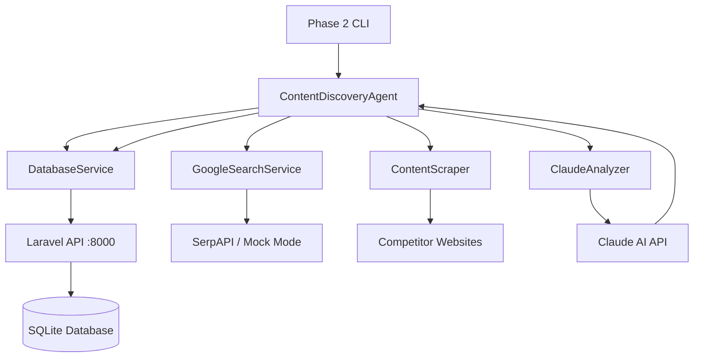

# Phase 2: Automated Content Discovery & Enhancement System

## Overview

Phase 2 implements an intelligent automation system that enhances original articles using competitive analysis and Claude AI. The system:

1. **Fetches** original articles from the Laravel backend API
2. **Searches** Google for competing content on the same topic
3. **Scrapes** the top 2 competitor articles for analysis
4. **Analyzes** using Claude AI (Sonnet 4) to identify improvements
5. **Generates** enhanced versions with better SEO and content
6. **Publishes** enhanced articles back to the database with citations

## Architecture



## Technology Stack

- **Node.js** 20.18.0 - Runtime environment
- **Axios** - HTTP client for API requests
- **Cheerio** - HTML parsing and content extraction
- **@anthropic-ai/sdk** - Claude AI integration
- **Chalk** - Terminal color output
- **Ora** - Terminal spinners and progress
- **Inquirer** - Interactive CLI prompts
- **Dotenv** - Environment configuration

## Installation & Setup

### 1. Navigate to Phase 2 Directory

```bash
cd phase2/automated-script
```

### 2. Install Dependencies

```bash
npm install
```

### 3. Configure Environment

```bash
cp .env.example .env
```

Edit `.env` file:

```env
# Claude AI API Key (Required)
ANTHROPIC_API_KEY=sk-ant-api03-xxxxx

# SerpAPI Key (Optional - uses mock mode if not provided)
SERP_API_KEY=your_serpapi_key_here

# Laravel Backend URL
BACKEND_API_URL=http://localhost:8000/api

# Demo Mode (adds watermarks, limits processing)
DEMO_MODE=true

# Configuration
LOG_LEVEL=info
MAX_ARTICLES_TO_PROCESS=5
```

### 4. Ensure Laravel Backend is Running

```bash
# In backend-laravel directory
php artisan serve
```

## Usage

### Interactive Mode (Recommended)

```bash
npm start
```

This launches an interactive CLI with options:
- 🔍 **Process a Single Article** - Select one article to enhance
- 🚀 **Process All Articles** - Batch process all original articles
- 📊 **View Statistics** - See database stats
- 📋 **List All Articles** - View all articles in database
- ❌ **Exit** - Quit the program

### Command Line Mode

```bash
# Process all articles in batch
npm run process:all

# Process single article (interactive prompt)
npm run process:single
```

## Workflow Details

### Step 1: Article Selection
- Fetches all articles from Laravel API
- Filters for original articles (not AI-generated)
- Presents selection menu (interactive) or processes all (batch)

### Step 2: Google Search
- Searches Google for the article title
- Uses SerpAPI if key provided, otherwise mock mode
- Filters results to blog/article URLs only
- Returns top 10 results

### Step 3: Content Scraping
- Scrapes top 2 competitor articles
- Extracts clean text from `<article>`, `<main>`, or common content selectors
- Handles various website structures
- Respects rate limiting (3-second delays)
- Timeout: 30 seconds per page

### Step 4: Claude AI Analysis
- Sends original + competitor articles to Claude Sonnet 4
- Analyzes content similarity (0-100% score)
- Identifies ranking factors (why competitors rank better)
- Extracts keywords and topics
- Generates enhanced version with better SEO
- Creates alternative titles
- Provides actionable recommendations

### Step 5: Database Update
- Updates original article metadata with:
  - `lastAnalyzed` timestamp
  - `similarityScore` from analysis
  - `rankingFactors` array
  - `keywords` array
  - `references` to competitor articles

### Step 6: Publishing Enhanced Version
- Creates new article with:
  - Enhanced title (e.g., "Original Title (AI-Enhanced)")
  - Improved content from Claude analysis
  - Better SEO optimization
  - References section with citations
  - Metadata flags: `isAIGenerated: true`, `sourceType: 'enhanced'`

## Example Output

```
============================================================
📝 Processing: Choosing the right AI chatbot : A Guide
============================================================

🔍 Step 1/6: Searching Google...
✓ Found 8 relevant articles

📊 Step 2/6: Selected top 2 results:
   1. AI Chatbot Selection Guide | TechCrunch
      https://techcrunch.com/ai-chatbot-guide
   2. Best AI Chatbots for Business | Forbes
      https://forbes.com/best-ai-chatbots

📄 Step 3/6: Scraping competitor content...
   ✓ Scraped: AI Chatbot Selection Guide | TechCrunch...
   ✓ Scraped: Best AI Chatbots for Business | Forbes...
✓ Successfully scraped 2 articles

🤖 Step 4/6: Analyzing with Claude AI...
✓ Analysis complete!
   Similarity Score: 67%
   Ranking Factors: 5

💾 Step 5/6: Updating database...
✓ Original article updated

📤 Step 6/6: Publishing enhanced versions...
   ✓ Published: Choosing the right AI chatbot : A Guide (AI-Enhanced)
✓ Published 1 enhanced version(s)

✅ Processing complete!
   Articles analyzed: 2
   Similarity score: 67%
   Enhancements: 1
```

## Mock Mode (No API Keys)

If you don't have API keys, the system runs in **mock mode**:

- **Google Search**: Returns mock Wikipedia/IBM results
- **Claude AI**: Uses predefined analysis template
- **Content Scraping**: Still works (real HTTP requests)

This allows testing the full workflow without API costs.

## Features

### ✅ Google Search Integration
- SerpAPI integration with 100 free searches/month
- Fallback to mock mode if no API key
- Filters for blog/article URLs only
- Excludes social media, YouTube, etc.

### ✅ Intelligent Content Scraping
- Handles various website structures
- Extracts clean text (removes ads, navigation)
- UTF-8 encoding support
- Respects robots.txt
- Rate limiting (3s delays)

### ✅ Claude AI Analysis
- Uses latest Claude Sonnet 4 model
- 4000 token max for responses
- Structured JSON output
- Retry logic (3 attempts)
- Copyright-safe content generation

### ✅ Beautiful CLI Interface
- ASCII art banner
- Colored output (success/error/info)
- Progress spinners
- Summary tables
- Interactive prompts

### ✅ Error Handling
- Graceful failures at each step
- Continues processing on non-critical errors
- Detailed error logging
- Partial results on failures

### ✅ Rate Limiting
- 3-second delays between scraping requests
- 5-second delays between article processing
- Prevents API abuse
- Demo mode limits (max 5 articles)

## Database Schema Changes

Enhanced articles have additional metadata:

```json
{
  "metadata": {
    "isAIGenerated": true,
    "sourceType": "enhanced",
    "lastAnalyzed": "2025-12-30T14:27:43.000Z",
    "similarityScore": 67,
    "rankingFactors": [
      "Longer content (2500 words vs 1200 words)",
      "Includes case studies and examples",
      "Better keyword density"
    ],
    "keywords": ["AI", "chatbot", "automation"],
    "references": [
      {
        "title": "Competitor Article",
        "url": "https://example.com/article"
      }
    ]
  }
}
```

## Troubleshooting

### Issue: "Backend connected" fails

**Solution**: Ensure Laravel backend is running on port 8000:
```bash
cd backend-laravel
php artisan serve
```

### Issue: "No articles to process"

**Solution**: First scrape articles using Laravel:
```bash
cd backend-laravel
php artisan scrape:articles --count=5
```

### Issue: 400 error when publishing

**Solution**: Check Laravel logs and ensure validation passes:
```bash
tail -f backend-laravel/storage/logs/laravel.log
```

### Issue: Claude AI errors

**Solution**: Verify API key is valid:
```bash
# Check .env file
cat .env | grep ANTHROPIC
```

## Performance

- **Single Article**: ~45-60 seconds
  - Google Search: 2-3s
  - Scraping (2 articles): 10-15s
  - Claude Analysis: 15-20s
  - Database Updates: 5-10s

- **Batch Processing**: ~5 minutes for 5 articles
  - Includes 5-second delays between articles
  - Total: ~60s per article × 5 articles

## Security & Best Practices

- ✅ API keys stored in `.env` (not committed to git)
- ✅ Rate limiting to prevent abuse
- ✅ User-Agent identifies as assignment bot
- ✅ Respects robots.txt
- ✅ Demo mode limits for safe testing
- ✅ No hardcoded credentials
- ✅ Error handling prevents crashes

## Future Enhancements

- [ ] Support for multiple LLM providers (OpenAI GPT-4)
- [ ] Scheduled automation (cron jobs)
- [ ] Email notifications on completion
- [ ] A/B testing of enhanced vs original
- [ ] SEO score tracking over time
- [ ] Custom prompt templates
- [ ] Integration with content management systems

## Credits

**Author**: Salugu Harshita Bhanu  
**Project**: BeyondChats Full Stack Assignment  
**Phase**: 2 - Automated Content Discovery  
**Date**: December 2025  
**License**: MIT with Attribution

---

For issues or questions, check the main [README.md](../../README.md) or review the [LARAVEL_API_GUIDE.md](../../docs/LARAVEL_API_GUIDE.md).
